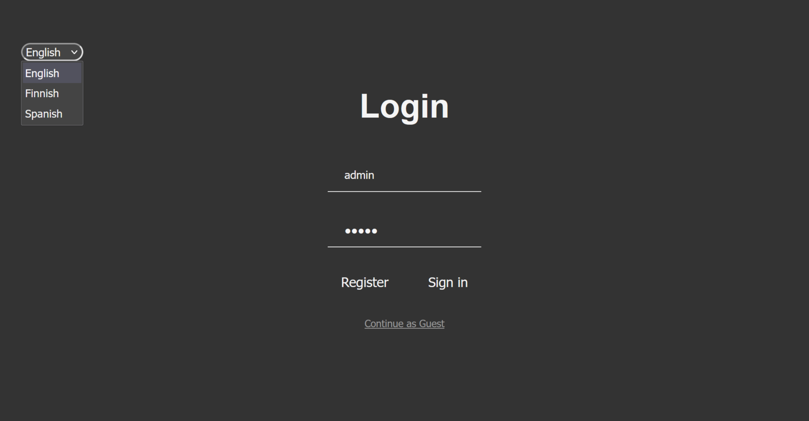
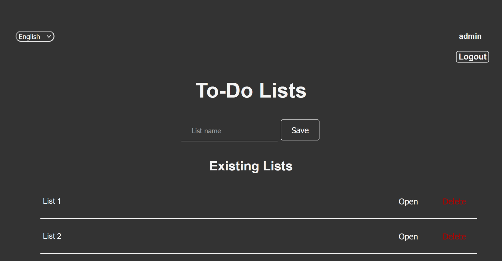
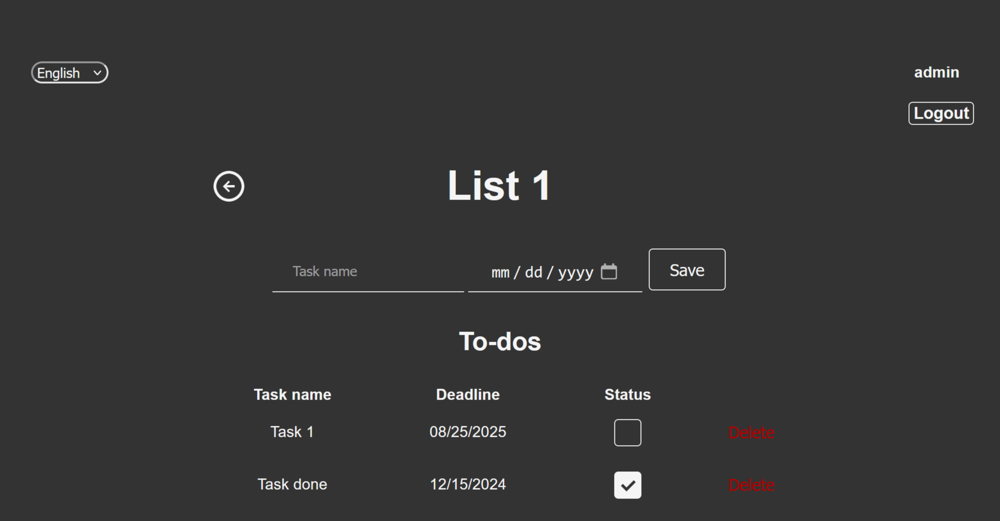

# 📝 Todo-list Application

## 📋 Overview

The Todo-list application is a web-based task management tool developed as my final project in the Haaga-Helia back-end course. It allows users to create, manage, and organize their to-do lists. The application supports multiple languages and includes user authentication and authorization features.

## ✨ Features

- User registration and login
- Create, update, and delete to-do lists
- Add, update, and delete tasks within to-do lists
- Mark tasks as completed or pending
- Multi-language support (English, Finnish, Spanish)
- User roles (Admin, Guest)
- Responsive design

## 🛠️ Technologies Used

- Java 17
- Spring Boot 3.2.5
- Spring Security
- Spring Data JPA
- Thymeleaf
- H2 Database (for local development)
- Maven

## 🚀 Getting Started

### Prerequisites

- Java 17 or higher
- Maven 3.6.0 or higher

### Installation

1. Clone the repository:
    ```sh
    git clone https://github.com/Maajoo/todo-list.git
    cd todo-list/todo
    ```

2. Build the project using Maven:
    ```sh
    ./mvnw clean install
    ```

3. Run the application:
    ```sh
    ./mvnw spring-boot:run
    ```

4. Access the application at [http://localhost:8080](http://localhost:8080).

### Configuration

The application uses an H2 in-memory database for local development. You can access the H2 console at [http://localhost:8080/h2-console](http://localhost:8080/h2-console).

### Default Users

The application comes with two default users:

- **Admin**
  - Username: `admin`
  - Password: `admin`
- **Guest**
  - Username: `guest`
  - Password: `guest`

## 📸 Screenshots

Here are some screenshots of the application:

<div style="display: flex; justify-content: space-around;">
    
    
    
</div>

## 📚 API Endpoints

- `/api/todos` - Get all to-do lists
- `/api/todo/{id}` - Get a to-do list by ID
- `/api/todoitems` - Get all to-do items
- `/api/todoitem/{id}` - Get a to-do item by ID

## 🙏 Acknowledgements

- [Spring Boot](https://spring.io/projects/spring-boot)
- [Thymeleaf](https://www.thymeleaf.org/)
- [H2 Database](https://www.h2database.com/)
